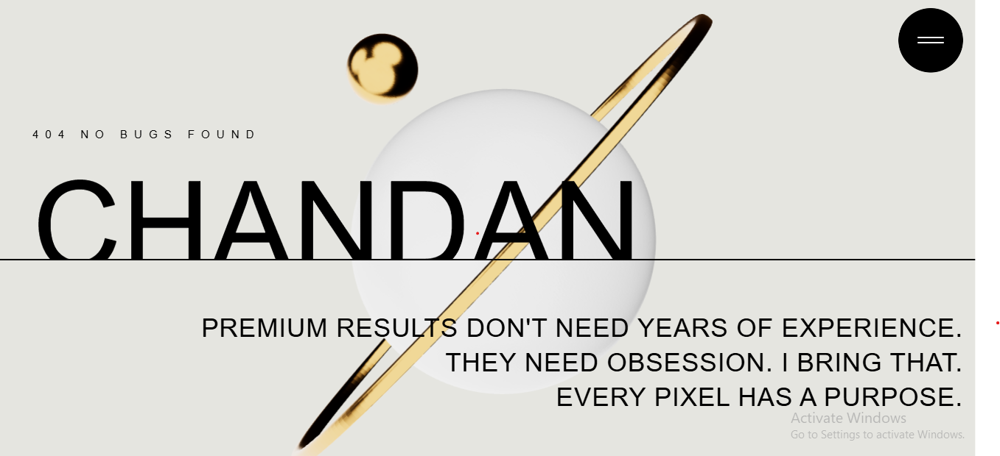

# 🚀 Chandan Kumar — 3D Developer Portfolio

### *Where Code Meets Creativity in Three Dimensions*

 

### 🌐 [View Live Demo](https://chandan404.netlify.app) &nbsp;·&nbsp; ⭐ [Star this Repo](https://github.com/Dev-Chandan404/3d-portfolio) &nbsp;·&nbsp; 🐛 [Report Bug](https://github.com/Dev-Chandan404/3d-portfolio/issues)

 

  
   
  <em>My–Portfolio</em>

---

## ✨ About The Project

> A cutting-edge **3D interactive portfolio** that goes beyond the ordinary. Built with the latest web technologies to deliver a stunning visual experience that makes your work stand out from the crowd.

This portfolio combines the power of **Three.js 3D graphics**, **GSAP animations**, and **React's component architecture** to create an immersive experience for anyone who visits. Every scroll, hover, and click is crafted to leave a lasting impression.

---

## 🎯 Key Features

| Feature | Description |
|---------|-------------|
| 🎮 **Interactive 3D** | Real-time 3D scenes powered by Three.js & React Three Fiber |
| 🎬 **GSAP Animations** | Buttery smooth transitions and scroll-triggered animations |
| 📱 **Fully Responsive** | Looks great on mobile, tablet, and desktop |
| ⚡ **Blazing Fast** | Optimized with Vite for lightning-fast load times |
| 🎨 **Modern UI** | Clean and minimal design with Tailwind CSS |
| 🌙 **Dark Theme** | Sleek dark aesthetic throughout |

---

## 🛠️ Built With

---

## 📂 Portfolio Sections

🏠 Hero          →  Stunning 3D animated introduction
👨‍💻 About         →  My story, background & passion
🛠️  Skills        →  Technologies & tools I master
🚀 Projects      →  Featured work & case studies
📬 Contact       →  Let's connect & collaborate

---

## 🚀 Getting Started

### Prerequisites

- **Node.js** >= 18.0.0
- **npm** >= 9.0.0 or **yarn**
- **Git**

### ⚡ Quick Start

# 1️⃣ Clone the repository
git clone https://github.com/Dev-Chandan404/3d-portfolio.git

# 2️⃣ Navigate into the project
cd 3d-portfolio

# 3️⃣ Install all dependencies
npm install

# 4️⃣ Start the development server
npm run dev

🎉 Open http://localhost:5173 and see the magic!

### 📦 Build for Production

npm run build
npm run preview

---

## 🌍 Deployment

This project is live on **Netlify** with automatic deployments from the `main` branch.

1. Fork this repository
2. Go to netlify.com → New Site → Import from Git
3. Connect your forked repo
4. Set Build Command → npm run build
5. Set Publish Dir → dist
6. Click Deploy! 🚀

---

## 📁 Project Structure

3d-portfolio/
├── 📂 public/           # Static assets & 3D models
├── 📂 src/
│   ├── 📂 assets/       # Images, icons & media
│   ├── 📂 components/   # Reusable React components
│   ├── 📂 constants/    # Data & configuration
│   ├── 📂 styles/       # Global styles
│   ├── App.jsx          # Root component
│   └── main.jsx         # Entry point
├── index.html
├── tailwind.config.js
├── vite.config.js
└── package.json

---

## 📄 License

Distributed under the **MIT License**.

---

## 🙋‍♂️ Let's Connect!

**Chandan Kumar**

 

⭐ **If you like this project, please give it a star!** ⭐

*Made with ❤️ by Chandan Kumar*

