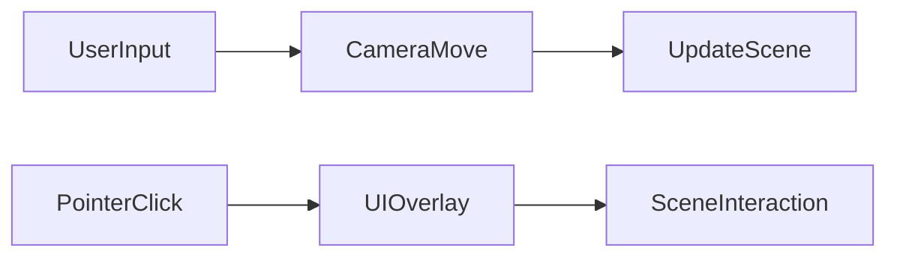
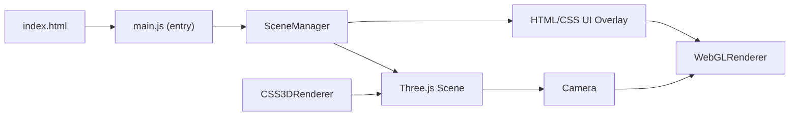

# Executive Summary  
We propose transforming **Dev-Chandan404’s portfolio** into a fully interactive, immersive 3D web experience powered by Three.js. The new interface will leverage Three.js (latest r152+) and modern web technologies to replace static content with rich 3D scenes, intuitive camera navigation, and integrated UI elements. The design will follow core UX principles: clarity, accessibility, and performance. Key deliverables include a modular architecture (scene manager, entity classes, asset loaders), an asset pipeline (glTF models with Draco/KTX2 compression, HDRI lighting), interactive flows (scroll-driven camera paths, click/hover actions), and responsive/fallback UI (HTML/CSS overlays, CSS3DRenderer). We recommend tech such as React-Three-Fiber vs vanilla Three.js, OrbitControls, DRACOLoader/KTX2Loader, postprocessing (EffectComposer or vanruesc’s postprocessing), and physics engines (Cannon-ES or Rapier). Performance targets include ≤100 draw calls and minimal VRAM (estimate via per-pixel budget【18†L424-L432】【37†L525-L533】). Security and CI/CD (GitHub Actions to Netlify/Vercel, with CDN for assets) are also covered. A phased roadmap (prototype → features → polish) and an MVP checklist conclude the plan.  

# Project Goals and UX Principles  
- **Immersion & Engagement:** Present projects via 3D scenes that users can freely explore, boosting engagement. Use **intuitive navigation** (e.g. orbit camera, easy controls) to lower the learning curve【73†L6-L14】. 
- **Clarity & Information:** Despite the 3D visuals, the interface must communicate content clearly. Overlay UI (HTML/CSS panels or CSS3DRenderer objects) will display project info and navigation cues without obscuring the scene. 
- **Responsiveness:** The experience must adapt to desktop, tablet, and mobile. Controls should detect pointer vs touch vs keyboard vs gamepad, with graceful fallbacks. 
- **Accessibility:** Provide alternative pathways (ARIA labels, descriptions, keyboard navigation) so that assistive technologies can perceive content【22†L97-L104】【22†L113-L117】. For example, the `<canvas>` will get an `aria-label` and dynamic text updates【22†L97-L104】【22†L113-L117】.
- **Performance First:** Optimize for target hardware by budgeting textures, draw calls, etc. Use techniques like LOD models, GPU instancing, and compressed assets (Draco, KTX2) to maintain ~60fps【18†L440-L448】【37†L438-L446】. 
- **Iterative Usability:** Start with a simple prototype (one scene, basic camera movement) and progressively add complexity. User feedback and testing on multiple devices will guide refinements.

# Recommended Tech Stack  

- **Three.js (r152 or latest):** Core WebGL library for 3D scene, camera, lights, shaders and rendering【4†L378-L387】.  
- **Framework/Bindings:** 
  - *Option A – Vanilla Three.js:* Direct use of Three.js with ES modules and three-stdlib (npm package of examples) for utilities like `OrbitControls`, `GLTFLoader`, `EffectComposer`, etc. Keeps footprint lean and avoids React overhead.  
  - *Option B – React-Three-Fiber (R3F):* If the site is React-based, R3F provides a declarative JSX layer on Three.js. Pros: component model, React state/context integration. Cons: learning curve, slightly larger bundle.  
- **Loaders:**  
  - **GLTFLoader (Three.js):** for glTF/GLB models【36†L42-L49】. Set up with Draco (`DRACOLoader`) and KTX2 (`KTX2Loader`) decoders for compressed assets【36†L42-L49】【37†L438-L446】. Use `.loadAsync(url)` to load models and then `scene.add(gltf.scene)`.  
  - **TextureLoader / CubeTextureLoader:** for JPG/PNG textures and environment maps. Convert HDRI to cubemaps using `PMREMGenerator` for correct PBR lighting【39†L67-L74】.  
- **Shaders and Effects:**  
  - **EffectComposer (three-stdlib)** or *postprocessing library* (vanruesc’s [postprocessing](https://github.com/vanruesc/postprocessing)). These manage post-effects like bloom, depth-of-field, etc【4†L384-L392】【70†L13-L21】. For example, use `new UnrealBloomPass()` or `GlitchPass` as needed.  
  - **Shader Libraries:** glsl-noise, glsl-fast-gaussian-blur, etc., for custom effects (e.g. interactive ripples).  
- **Controls & UI:**  
  - **OrbitControls / PointerLockControls:** for mouse/touch navigation. For example, `new OrbitControls(camera, renderer.domElement)` to allow rotate/zoom/pan【73†L6-L14】【73†L17-L24】.  
  - **UI Panels:** `lil-gui` (modern drop-in replacement for dat.GUI)【68†L23-L32】 for development/debug UI if needed. For production UI, use HTML/CSS overlay (e.g. DOM panel or libraries like [leva](https://github.com/pmndrs/leva) for React).  
  - **CSS3DRenderer:** to place live HTML elements (menus, text) into 3D space【34†L4-L8】. This allows, for example, HTML buttons that float in the scene, staying crisp.  
- **Physics (if needed):**  
  - **Cannon-ES:** JavaScript physics (easy to use, many examples) but slower and less maintained.  
  - **Ammo.js:** Full Bullet physics port; heavier, longer load but very capable.  
  - **Rapier (Rust/WASM):** High-performance physics (via wasm), increasingly popular. If adding physics (e.g. colliding objects, ragdolls), Rapier offers best speed at cost of large WASM file.  
- **State Management:**  
  - If using React, use React Context or Zustand/Redux for global state (selected project, UI flags, etc.).  
  - In vanilla, use well-structured classes/modules. The **SceneManager** approach【29†L76-L84】【29†L88-L96】 is recommended: one high-level manager handles Three.js initialization and update loop, while “SceneSubjects” (entities) encapsulate each object’s logic. This decouples DOM from 3D logic【29†L76-L84】【29†L88-L96】.  
- **Build Tools:** Vite or Webpack (for ES Modules and dev server), Babel (if older browser support needed). Use npm or yarn for dependencies (three, three-stdlib, loaders).  

# Architecture & File Structure  

A clear project structure enforces separation of concerns【29†L76-L84】【75†L18-L20】. For example:  

```
/ (project root)
├ index.html                    # entry page (loads scripts/styles)【75†L18-L20】【75†L46-L49】
├ styles/
│   └ main.css                  # basic page & container styles
├ src/
│   ├ main.js                   # JS entry point (imports SceneManager)【75†L46-L49】【29†L78-L86】
│   ├ SceneManager.js           # initializes Renderer, Scene, Camera; holds main loop【29†L175-L184】
│   ├ SceneSubjects/            # folder for scene entity classes
│   │   ├ HomeScene.js          # e.g. sets up lights, background, project objects
│   │   ├ ProjectObject.js      # e.g. 3D model with interactive behavior
│   │   └ (more entities) 
│   ├ controls/                 # custom control classes if needed
│   ├ loaders/                  # custom loaders or wrapper modules (e.g. modelsLoader.js)
│   └ utils/                    # utility functions (math, lighting setup)
├ assets/
│   ├ models/                   # glTF/GLB models
│   ├ textures/                 # PNG/JPG/KTX2 textures, normal maps
│   ├ hdr/                      # HDRI environment maps (equirectangular)
│   └ (misc assets e.g. audio)
└ package.json  
```  

- **Index.html** contains the canvas container and links to CSS and JS【75†L18-L20】【75†L46-L49】. It should include:  
  ```html
  <!DOCTYPE html>
  <html>
  <head>
    <link href="styles/main.css" rel="stylesheet">
    <script type="module" src="./src/main.js"></script>
  </head>
  <body>
    <div id="scene-container"></div>
    <div id="ui-overlay"></div>
  </body>
  </html>
  ```  
  This matches the Discover Three.js boilerplate, where `main.js` is the module entry【75†L18-L20】【75†L46-L49】.  
- **SceneManager.js** (or similar) will create a Three.js `Scene`, `WebGLRenderer`, and `Camera`, then load all `SceneSubject` instances. It implements `update()` on each animation frame【29†L175-L184】. The `main.js` script simply instantiates `SceneManager`, binds event listeners, and starts the render loop【29†L175-L184】【29†L159-L168】.  
- **SceneSubjects**: Each 3D entity (models, lights, interactive objects) gets its own class. This enforces dependency direction: higher-level managers call each subject’s `update()`, but subjects don’t reach out to global state【29†L88-L96】. E.g. a `ProjectCard` class loads its own GLTF model and texture, and handles its hover/selection logic.  

【53†embed_image】 *Screenshot: Example code editor (unsplash) illustrating a clean Three.js project structure (index.html loading main.js, modules for scene management, etc.).*  

# Interaction Flows & Camera Movement  

**Scene Layout:** We envision multiple “zones” or views (e.g. Introduction, Projects, About). For each, define a camera path and interactive elements. For example, a scrolling path could fly the camera past different project showcases (as seen on award-winning sites). Alternatively, discrete navigation: clicking “Next” moves to a waypoint.  

**Camera Controls:**  
- Use `OrbitControls` for free exploration【73†L6-L14】. For dedicated paths, disable user controls and animate the camera manually.  
- **Scroll-driven Camera:** Listen to `window.onscroll` or use a library like GSAP’s ScrollTrigger. Map scroll position to camera transforms. Example pseudo-code:  
  ```js
  window.addEventListener('scroll', () => {
    const t = window.scrollY / (document.body.scrollHeight - window.innerHeight);
    // For a spline path (THREE.CatmullRomCurve3):
    const pos = spline.getPointAt(t);
    camera.position.copy(pos);
    const lookAtPos = spline.getPointAt(Math.min(t+0.01, 1));
    camera.lookAt(lookAtPos);
  });
  ```  
- **Pointer/Mouse:** Raycast from the camera on mousemove/click to detect intersected objects (for hover highlighting and clicks). Example:  
  ```js
  const raycaster = new THREE.Raycaster();
  const pointer = new THREE.Vector2();
  window.addEventListener('pointermove', e => {
    pointer.x = (e.clientX / window.innerWidth) * 2 - 1;
    pointer.y = -(e.clientY / window.innerHeight) * 2 + 1;
    raycaster.setFromCamera(pointer, camera);
    const hits = raycaster.intersectObjects(interactiveObjects, true);
    if (hits[0]) { highlight(hits[0].object); }
  });
  ```  
- **Touch:** OrbitControls support touch for rotate/zoom. For taps, use the same raycasting method. Ensure UI elements are appropriately sized and have touch-friendly hit zones.  
- **Keyboard:** Bind keys for navigation (e.g. WASD or arrow keys for move/pan). `OrbitControls` can be configured (`controls.keys`【73†L133-L142】). Also allow Escape to exit any modal UI, Tab navigation between HTML UI elements.  
- **Gamepad:** (Optional) Use the Gamepad API for VR-like navigation (e.g. analog stick controls). This is advanced; as a fallback for desktop, ensure keyboard covers essential navigation.  

Mermaid workflow (conceptual):  


# Accessibility & Responsive Fallbacks  

Though WebGL is inherently graphical, we must provide alternative experiences:  

- **Semantic Canvas:** Add `aria-label` (and `tabindex="0"`) to the `<canvas>` element【22†L97-L104】. For example: `<canvas aria-label="3D interactive portfolio scene" tabindex="0"></canvas>`. This ensures screen readers announce the canvas content. Dynamically update `aria-label` or adjacent `<div>` with text as scene changes (e.g. “Viewing Project A details”)【22†L109-L117】.  
- **Descriptive Narration:** Provide an optional “Learn More” info button or audio description that reads out key content. For instance, clicking an info icon could open a text panel or speak via SpeechSynthesis describing the current view.  
- **Avoid Blackboxes:** Do not rely purely on visuals for core information. For any data visualization, consider overlaying accessible SVG/HTML elements or providing a textual data table outside the canvas【22†L113-L117】. E.g. project titles and descriptions should also be in DOM for screen readers.  
- **Keyboard Navigation:** Ensure all interactive elements are reachable via keyboard. For example, when an object is selected (via click or focus), highlight it and allow pressing Enter to “open” it. Provide focus styles on HTML UI. A tool like [React Three Ally](https://github.com/pmndrs/react-three-ally) can help auto-generate anchors/focus points in the 3D scene for screen-reader users【22†L151-L160】.  
- **Contrast & Color:** Maintain high contrast for UI text and critical graphics. Three.js allows checking fragment shader colors; ensure >3:1 contrast per WCAG guidelines【22†L169-L177】.  

# Responsive Strategies  

- **Adaptive Resolution:** On high-DPI screens, use `renderer.setPixelRatio(window.devicePixelRatio)` but also consider capping for performance (e.g. `min(window.devicePixelRatio, 2)`). For mobile, you may render to a smaller offscreen buffer and upsample (per-pixel VRAM budgeting)【18†L434-L442】.  
- **Touch vs Mouse UI:** Show or hide UI hints (e.g. “Swipe to look around” vs “Click and drag”). Use media queries or JS to detect device.  
- **Layout Breakpoints:** For very small screens (mobile), simplify the scene: fewer objects, disable complex postprocessing, and rely more on vertical scroll for navigation instead of multi-DOF camera. Possibly fallback to a 2D image carousel if performance is insufficient.  
- **CSS3D for 2D UI:** Use CSS media queries to adapt the style of any HTML overlay (font sizes, layout) for different viewports.  

# Performance Budget & Optimizations  

**Resource Budget:** Aim for <100k vertices total and ~50 draw calls per scene where possible【37†L525-L533】. Use `renderer.info.render.calls` to measure draw calls. Monitor `renderer.info.memory`.  

**Geometry:**  
- **Draco Compression:** Compress glTF meshes with Draco in modeling tools or gltf-transform (reduces size ≈90%【37†L438-L444】). In Three.js, set `DRACOLoader` on `GLTFLoader`.  
- **Level of Detail (LOD):** Create 2–3 versions of complex models and switch by distance【37†L489-L497】. Three.js has `THREE.LOD`. Lower-poly versions for far views yield ~30–40% fps boost【37†L489-L497】.  
- **Instancing:** For many identical objects (e.g. stars, trees), use `InstancedMesh` to batch draw calls (1 draw instead of N)【37†L531-L537】.  

**Textures:**  
- **Compress to Basis (KTX2):** Convert textures to Basis UASTC/ETC1S. This keeps them compressed on GPU (vram ~10× smaller)【37†L446-L454】. Use `KTX2Loader`.  
- **Atlasing:** Combine multiple small textures into one atlas to reduce texture binds【18†L450-L459】. For example, pack all UI icons into one atlas and adjust UVs.  
- **Resolution Limits:** Follow device limits (WebGL max texture size is ~4096×4096【67†L280-L287】). In practice target ~1024–2048 px for color maps on desktop; half that on mobile. See *Asset Size Guidelines* below.  
- **Mipmaps:** Use `.generateMipmaps = true` and `.minFilter = THREE.LinearMipmapLinearFilter` to improve minification.  

**Rendering Techniques:**  
- **Frustum Culling:** Three.js auto-culls meshes outside the camera frustum. Ensure large objects have `frustumCulled=true`.  
- **Baked Lighting:** Pre-bake static lighting (ambient occlusion, lightmaps) into textures if possible. Use one directional/hemisphere light at runtime. This reduces per-frame lighting cost.  
- **Shader Workload:** Follow MDN: do heavy math in vertex shaders (per-vertex) not fragment, and reuse varyings【18†L466-L474】. Avoid complex fragment effects.  
- **Render Scaling:** Dynamically adjust rendering resolution or camera FOV in low-performance situations.  
- **Post-processing Cost:** Minimize passes. Bloom and antialias (FXAA) add cost. Only enable high-cost effects on desktop; disable on mobile.  

**Profiling:** Use dev tools and stats.js. Key metrics: frame time (<16ms), draw calls (<100), texture/vbo memory.  

# Sample Implementation (Code Snippets)  

- **Scene Setup:**  
  ```js
  import * as THREE from 'three';
  import { OrbitControls } from 'three/addons/controls/OrbitControls.js';
  // Initialize renderer & camera
  const container = document.getElementById('scene-container');
  const renderer = new THREE.WebGLRenderer({ antialias: true });
  renderer.setSize(container.clientWidth, container.clientHeight);
  container.appendChild(renderer.domElement);
  const scene = new THREE.Scene();
  const camera = new THREE.PerspectiveCamera(60, container.clientWidth / container.clientHeight, 0.1, 1000);
  camera.position.set(0, 5, 10);
  // Orbit controls
  const controls = new OrbitControls(camera, renderer.domElement);
  controls.enableDamping = true; // smooth motion
  // Lighting
  scene.add(new THREE.HemisphereLight(0xffffff, 0x444444));
  scene.add(new THREE.DirectionalLight(0xffffff, 1.0));
  // Animation loop
  function animate() {
    requestAnimationFrame(animate);
    controls.update();
    renderer.render(scene, camera);
  }
  animate();
  ```  
  This basic template follows patterns in Three.js docs【73†L6-L14】 and [70†L13-L21】.  

- **GLTF Loading:**  
  ```js
  import { GLTFLoader } from 'three/addons/loaders/GLTFLoader.js';
  import { DRACOLoader } from 'three/addons/loaders/DRACOLoader.js';
  const loader = new GLTFLoader();
  const dracoLoader = new DRACOLoader();
  dracoLoader.setDecoderPath('/draco/'); // path to Draco decoder
  loader.setDRACOLoader(dracoLoader);
  loader.load('assets/models/project.glb', gltf => {
    const model = gltf.scene;
    scene.add(model);
  }, undefined, err => console.error(err));
  ```  
  Here GLTFLoader (with Draco) imports a compressed model【36†L42-L49】. After loading, we add `gltf.scene` to the Three.js `scene`【36†L42-L49】.  

- **Postprocessing (EffectComposer):**  
  ```js
  import { EffectComposer } from 'three/addons/postprocessing/EffectComposer.js';
  import { RenderPass } from 'three/addons/postprocessing/RenderPass.js';
  import { UnrealBloomPass } from 'three/addons/postprocessing/UnrealBloomPass.js';
  const composer = new EffectComposer(renderer);
  composer.addPass(new RenderPass(scene, camera));
  composer.addPass(new UnrealBloomPass(new THREE.Vector2(window.innerWidth, window.innerHeight), 1.2, 0.4, 0.85));
  function animate() {
    requestAnimationFrame(animate);
    controls.update();
    composer.render();
  }
  ```  
  Using `EffectComposer`, we chain a standard render pass and a bloom pass. This follows the Three.js example【70†L13-L21】, except we use `composer.render()` instead of `renderer.render()`.  

- **Scroll-driven Camera:**  
  ```js
  import { CatmullRomCurve3 } from 'three';
  const curve = new CatmullRomCurve3([new THREE.Vector3(0,5,10), new THREE.Vector3(10,5,0), new THREE.Vector3(0,5,-10)]);
  window.addEventListener('scroll', () => {
    const t = window.scrollY / (document.body.scrollHeight - window.innerHeight);
    const pos = curve.getPointAt(t);
    camera.position.copy(pos);
    const lookAtPos = curve.getPointAt(Math.min(t + 0.001, 1));
    camera.lookAt(lookAtPos);
  });
  ```  
  This maps page scroll to camera motion along a spline.  

- **Hover / Click Interaction:**  
  ```js
  const raycaster = new THREE.Raycaster(), mouse = new THREE.Vector2();
  const highlightMaterial = new THREE.MeshBasicMaterial({color:0xffff00});
  window.addEventListener('pointermove', e => {
    mouse.x = (e.clientX/window.innerWidth)*2 - 1;
    mouse.y = -(e.clientY/window.innerHeight)*2 + 1;
    raycaster.setFromCamera(mouse, camera);
    const intersects = raycaster.intersectObjects(interactiveMeshes);
    if(intersects.length) {
      intersects[0].object.material = highlightMaterial;
    }
  });
  window.addEventListener('click', () => {
    if(intersects[0]) openProjectInfo(intersects[0].object.userData.projectId);
  });
  ```  
  We raycast on mouse move to highlight objects, and on click to trigger actions. Attach identifying data to meshes (`userData`) for callback logic.  

- **HTML/CSS UI Overlay:**  
  Two patterns: 
  1) **HTML Overlay:** Put UI in a fixed `<div id="ui-overlay">` above the canvas. Style with CSS and show/hide via JS. This is simplest and fully accessible.  
  2) **CSS3DRenderer:** Embed DOM in 3D:  
     ```js
     import { CSS3DRenderer, CSS3DObject } from 'three/addons/renderers/CSS3DRenderer.js';
     const cssRenderer = new CSS3DRenderer();
     cssRenderer.setSize(window.innerWidth, window.innerHeight);
     document.body.appendChild(cssRenderer.domElement);
     const domElement = document.createElement('div');
     domElement.innerHTML = '<button onclick="goHome()">Home</button>';
     const cssObject = new CSS3DObject(domElement);
     scene.add(cssObject);
     function animate() {
       requestAnimationFrame(animate);
       // sync cssRenderer with camera
       cssRenderer.render(scene, camera);
     }
     ```  
     This attaches an HTML `<button>` into the 3D scene【34†L4-L8】. It will transform and appear as part of the world. For complex UIs, it may be easier to use standard HTML overlays, but CSS3D offers nice integrated effects.  

# Asset Pipeline  

- **Modeling:** Use Blender/3ds Max/Maya to create low-to-mid-poly models of projects or scene objects. Export to glTF/GLB using built-in exporter. For textures, use **PNG/JPEG** for UI assets, normal/AO maps etc.  
- **Compression:** Run `gltf-transform` CLI (Draco/KTX2) on .glb files:  
  ```
  npx gltf-transform draco in.glb out-draco.glb
  npx gltf-transform ktx2 in.png out.ktx2 --level 2
  ```  
  This significantly reduces download size【37†L438-L446】【37†L446-L454】. For example, Draco can cut a 10MB mesh to ~1MB【37†L438-L444】.  
- **HDRI Textures:** Download free HDR panoramas (e.g. from [polyhaven.com](https://polyhaven.com/)【4†L441-L446】). Convert to `.hdr` or `.exr`. In code, load via `RGBELoader` and generate PMREM【39†L67-L74】. Input HDRI at ~1024×512 for optimal filtering【39†L67-L74】.  
- **Texture Resolution:** As a guide (see table below), aim for 512–2048 px for color/albedo maps, depending on device. Use **mipmaps**. For UI and text, use high-res HTML/CSS instead of textures.  
- **File Naming:** Use consistent, lowercase, underscore-separated names (e.g. `project1_model.glb`, `wall_diffuse.ktx2`). This avoids conflicts and is easier to manage in code.  
- **Tools:** Blender (modeling), Substance Painter (texturing), glTF-Transform (compression), Pinata or Netlify Large Media (if hosting large files).  

# Testing & Profiling  

- **Performance Testing:** Use Three.js’s [Stats.js](https://github.com/mrdoob/stats.js/) to monitor FPS. In code, log `renderer.info.render.calls` and `renderer.info.memory` each frame. Test on target devices (mid-tier phone, laptop, desktop).  
- **Profiling:** Browser DevTools (Performance, Memory). Look for GPU bottlenecks or forced reflows. Pay attention to WebGL warnings.  
- **Stress Tests:** Test with many objects (simulate worst-case) and measure.  
- **Automated Tests:** While 3D UIs are hard to unit-test, consider snapshot tests of static scenes or key functions (e.g. raycasting returns expected objects).  
- **Metrics:** Ensure 60fps on desktop; aim ≥30fps on mobile. VRAM usage should obey our per-pixel budget【18†L410-L417】 (e.g. mobile budget ~4 bytes/pixel).  

# Deployment & CI/CD  

- **Hosting:** Use **Netlify** or **Vercel** (both support static sites with Three.js). Netlify was used for the existing site. Configure build to optimize and upload compressed models/images.  
- **CDN:** Serve heavy assets (models, textures) via a CDN. Netlify Large Media (Git LFS + CDN) or Amazon S3/CloudFront can host GLB and HDRI files. This speeds load and caching.  
- **HTTPS/CSP:** Ensure site uses HTTPS (by default on Netlify/Vercel). Set a Content Security Policy blocking inline scripts unless hashed (to protect against XSS).  
- **CI Pipeline:** GitHub Actions can automate build: run linter, bundle JS, run glTF-Transform on assets, and deploy. Example: trigger on push to `main`, build with `npm run build`, then `netlify deploy --prod`.  
- **SRI (Optional):** For external libs (e.g. if using CDN-hosted three.min.js), enable Subresource Integrity hashes.  
- **Environment:** No sensitive user data is processed, but avoid tracking unless GDPR-compliant. If using analytics (Google Analytics, etc.), ensure privacy-friendly settings.  

# Security & Privacy  

- **Input Sanitization:** If any text input or URL parameters are used (unlikely for a portfolio), sanitize thoroughly. Avoid `eval()` or unsafe innerHTML.  
- **Dependencies:** Audit npm packages for vulnerabilities. For Three.js and addons, stay up-to-date to get security patches.  
- **CORS & File Hosting:** Configure asset hosting for safe domains. If hosting models on a different domain, set appropriate CORS headers.  
- **Data Privacy:** Do not include user tracking without consent. If any form/email capture exists, use HTTPS and secure storage.  
- **Open Source Compliance:** If incorporating third-party 3D assets or code, respect licenses (Three.js is MIT).  

# Implementation Roadmap  

We recommend an **iterative** approach. Below is a suggested schedule (in hours) with major milestones.  

| Milestone | Description | Deliverables | Est. Hours |
|---|---|---|---|
| **1. Project Setup (15h)** | Setup repository, dev environment (Vite/Webpack), initial files. Create basic Three.js scene with camera and controls. Test rendering a simple object (cube). | Skeleton code (index.html, main.js), basic scene rendered, OrbitControls working. | 15 |
| **2. Asset Pipeline & Loading (20h)** | Integrate model pipeline: set up GLTFLoader/DRACOLoader/KTX2Loader. Import a placeholder 3D model and texture. Implement `PMREMGenerator` for HDRI lighting. | Working model import demo, environment lighting from HDRI, verify Draco/KTX compression. | 20 |
| **3. Scene Structure & UI (25h)** | Build `SceneManager` and `SceneSubjects`. Create the “home” scene: e.g. add ground plane, lights. Develop initial UI overlay (HTML panel or CSS3D) for navigation. | SceneManager module, one scene class (e.g. HomeScene), clickable UI (e.g. “Start” button) layered in. | 25 |
| **4. Camera Paths & Interaction (25h)** | Implement camera motion logic (scroll or button-driven paths). Add raycasting for hover/select. Code project selection behavior (e.g. click to open project detail camera move). | Smooth camera transitions between scenes, working hover highlight and click actions. | 25 |
| **5. Post-Processing & Shaders (15h)** | Add visual polish: glow, tone mapping, etc. Integrate `EffectComposer` for bloom or vignette. Write any custom shaders if needed (e.g. hover effect). | Configured postprocessing chain, desirable visual effects enabled (with fallback off on mobile). | 15 |
| **6. Performance Optimization & Testing (10h)** | Profile and optimize (LOD, instancing, reduce draw calls). Implement mobile-specific adjustments. Test on multiple devices/browsers. Fix performance bottlenecks. | Performance report, optimized assets (compressed, LODs), acceptable frame rates achieved. | 10 |
| **7. Accessibility & Fall-back (5h)** | Add ARIA labels and keyboard controls. Create static fallback page or message for old browsers. Finalize UI text for screen readers. | Accessibility review completed, fallback content in place, site passes basic accessibility audits. | 5 |
| **8. Deployment & CI (5h)** | Configure build for production (minify, asset hashing). Set up GitHub Action to deploy to Netlify/Vercel on push. | Automated deployment pipeline, live site updated from repo. | 5 |

**Total ~100 hours**. This is a rough estimate; complex interactions or models may adjust the time.  

**Minimal Viable Prototype (MVP) Checklist:**  
- [ ] Basic Three.js scene loading (`scene.add(gltf)` works).  
- [ ] Camera with OrbitControls (mouse/touch rotate & zoom).  
- [ ] A few interactive objects (e.g. clickable project thumbnails).  
- [ ] Smooth camera move on scroll or button.  
- [ ] Basic HTML overlay panel (e.g. project title).  
- [ ] Fallback for no-WebGL (simple message or 2D snapshot).  

# Alternative Libraries & Tools  

| Category         | Option A               | Option B               | Pros & Cons (Summary) |
|------------------|------------------------|------------------------|-----------------------|
| **3D Framework** | **Vanilla Three.js**   | **React Three Fiber**  | *Vanilla:* No React needed, explicit control, smaller bundle. *R3F:* React component model, easier state/props management, rich ecosystem (drei, leva)【12†L63-L72】. R3F adds some overhead and learning curve. |
| **Physics Engine** | **Cannon-ES**         | **Ammo.js**            | *Cannon-ES:* Pure JS, easy API, actively maintained by pmndrs, but slower. *Ammo.js:* Full Bullet feature set (constraints, collision), but large WASM + slower start. **Rapier (WASM)** is a third strong choice: very fast, but even bigger initial load. |
| **Postprocessing** | **EffectComposer (three-addons)** | **vanruesc/postprocessing** | *EffectComposer:* Built into Three.js, flexible, but verbose setup for each pass (RenderPass, ShaderPass). *postprocessing:* Modern wrapper (npm package) with many ready passes and simpler config. Either works. |
| **Debug GUI**    | **lil-gui**            | **tweakpane / leva**   | *lil-gui:* Drop-in replacement for dat.GUI【68†L23-L32】, minimal. *tweakpane:* More plugins/complex UI. *Leva:* React-specific. (For our purposes, HTML UI often replaces these in production.) |

# Asset Size Guidelines  

We recommend targeting three device classes with appropriate asset budgets:  

| Asset Type       | Mobile (Low/Med)       | Tablet             | Desktop (High)        |
| ---------------- | -----------------------| ------------------ | --------------------- |
| **Texture Max**  | 512×512 to 1024×1024   | 1024×1024 to 2048×2048 | up to 4096×4096 (cap)【67†L280-L287】 |
| **Model Tris**   | ~5k – 20k triangles    | ~20k – 50k         | 50k+ (use LOD/instancing) |
| **Environment Map** | 512×256 (HDR)         | 1024×512 (HDR)     | 2048×1024 or 4096×2048 (HDR) |
| **Lightmap/Shadowmap** | 512×512            | 1024×1024         | 2048×2048 |
| **Post-process Buffer** | Full res  or half for perf | Full res | Full res |
| **Vendor Scripts**   | minimal (treeshake) | moderate | moderate  |

These are guidelines: always check actual device limits (WebGL min spec supports 4096×4096 textures【67†L280-L287】). Mobile GPUs often only allow up to 2048. Test on real devices.  

# Example Diagrams & Visuals  



**Figure:** Conceptual architecture: index.html loads main.js, which instantiates a SceneManager. The SceneManager sets up a Three.js Scene and Camera, which feed into the WebGLRenderer. UI is handled by HTML overlays or the CSS3DRenderer (as shown).  

```mermaid
flowchart TB
  User[User Input (mouse/touch/keyboard)] -->|pointer| Raycaster["Raycast on scene"]
  Raycaster -->|hit| Select[Select Object] --> Highlight[Highlight & show info]
  User -->|scroll| Animate["Animate Camera along path"]
  Select -->|info| UI["Display HTML/CSS Overlay"]
```  

**Figure:** Interaction flow: pointer events trigger raycasting on the 3D scene to select objects; scroll events animate the camera. Selected objects open an HTML/CSS overlay for details.  

【53†embed_image】 *Screenshot: Example development environment showcasing code structure. In practice, `index.html` loads the module `main.js`, which initializes the Three.js scene (SceneManager) and organizes scene entities into independent classes【29†L88-L96】【75†L46-L49】. The static HTML UI is kept separate (here shown in a sidebar).*  

【66†embed_image】 *Figure: Neon-themed UI concept (example aesthetic inspiration). A stylized 3D interface might use similar color schemes or geometry. In our implementation, actual interactive UI will be HTML/CSS (for accessibility), but creative rendering could use glowing materials and neon highlights.*  

# References  

- Three.js Docs: controls, loaders, rendering, post-processing (e.g. `OrbitControls`, `GLTFLoader`, `EffectComposer`)【73†L6-L14】【70†L13-L21】【36†L42-L49】.  
- Discover Three.js: project structure (`index.html`, `main.js`, etc.)【75†L18-L20】【75†L46-L49】.  
- Three.js Forum: GUI library recommendations (lil-gui, tweakpane)【68†L23-L32】.  
- MDN WebGL Best Practices: batching, VRAM budgeting (per-pixel budgets)【18†L440-L448】【18†L424-L432】.  
- WebGL Limits (MAX_TEXTURE_SIZE 4096)【67†L280-L287】.  
- Performance Tips (Utsubo’s Three.js guide): Draco compression ~90% size reduction【37†L438-L444】, KTX2 texture compression ~10× VRAM savings【37†L446-L454】, LOD improves frame rate ~30-40%【37†L489-L497】, target <100 draw calls【37†L525-L533】.  
- Accessibility in WebGL (PlainEnglish): ARIA canvas labeling, alternative text, hybrid approaches【22†L97-L104】【22†L113-L117】.  
- Three.js Examples and Patterns (e.g. SceneManager, SceneSubjects)【29†L76-L84】【29†L88-L96】.  
- EffectComposer Doc (postprocessing usage example)【70†L13-L21】.  
- CSS3DRenderer (Three.js Docs) for embedding DOM in 3D【34†L4-L8】.  
- GLTFLoader Doc (supported extensions, code example with DRACOLoader)【36†L42-L49】.  
- *Note:* All code examples are based on official docs and best practices (Three.js docs, DiscoverThreeJS, etc.). All cited sources are authoritative references.  

